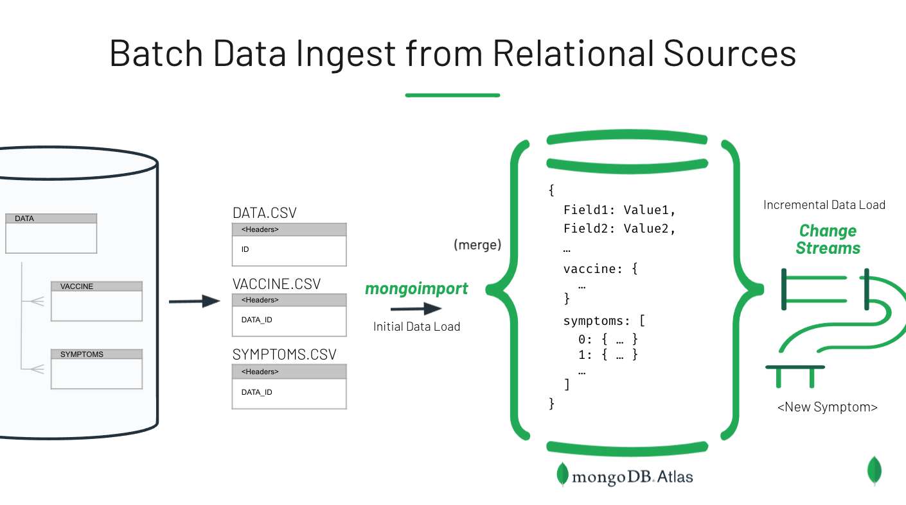

# Loading Relational Data into MongoDB

This data comes from VAERS (Vaccine Adverse Event Reporting System), accessible [here](https://vaers.hhs.gov/data/datasets.html?), and includes the main data file and two related files for symptoms and vaccine information. Data from these 3 files can be merged into a single document using mongoimport, which supports both nested data and embedded arrays (using certain naming conventions in the CSV header line). The vaccine data is loaded as a subdocument, and the symptoms are loaded as an embedded array of documents. Note that assumptions are being made here for illustrative purposes - the vaccine data is assumed to be a 1-to-1 relationship while the symptoms are assumed to be 1-to-Many.

