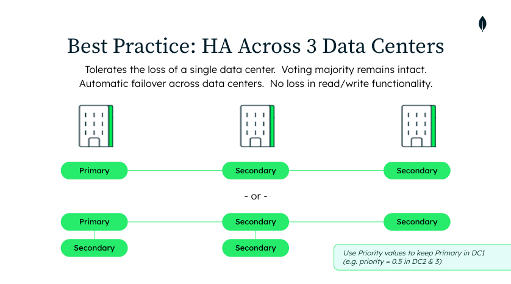
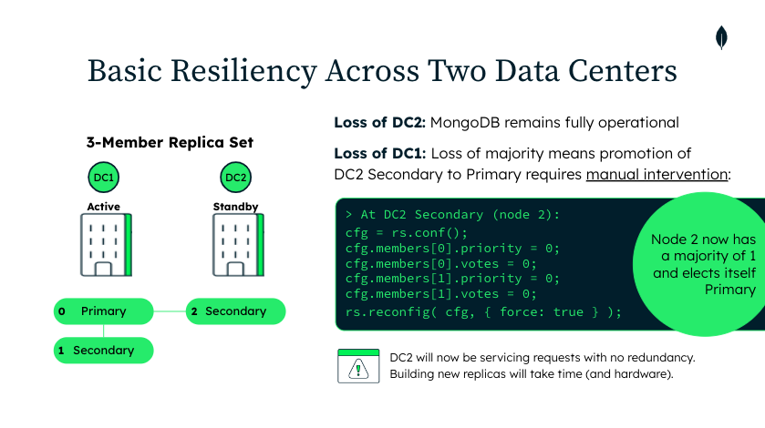
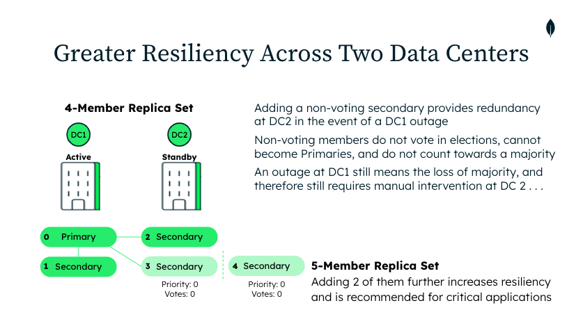
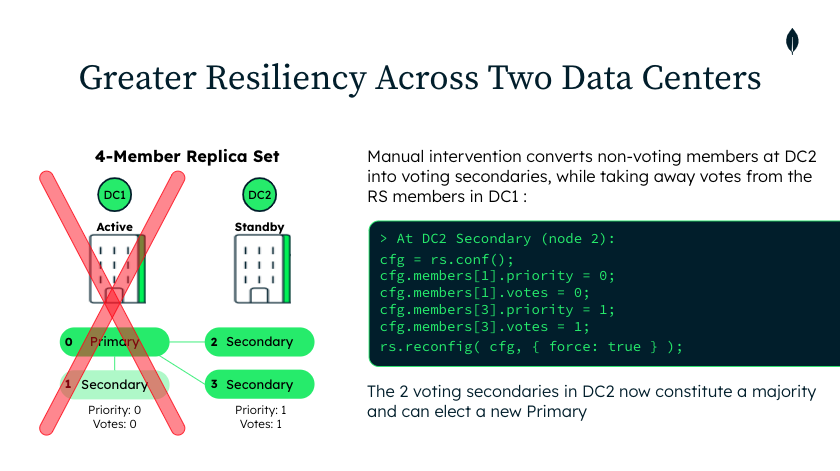

# Architecting for Multiple Data Centers

MongoDB Replica Sets provide automatic failover and high availability. 3-, 5-, and 7-node Replica Set can tolerate one, two or three failures, respectively. Documentation can be found here: https://www.mongodb.com/docs/manual/core/replica-set-sync/.

Automatic failover occurs when a majority of voting members collectively identify the failure of the active Primary. By distributing these voting members across geographically distributed sites, MongoDB systems can remain fully operational, even in the event of a data center outage. To preserve the voting majority in such an event, Primary members should be distributed across three data centers. The following diagram shows two such configurations, for 3- and 5-node replica sets. 

If only two data centers are available, outside intervention is required to make the determination that a data center outage has occurred. Reconfiguration of the Replica Set will restore read/write operations in the surviving data center. This is shown in the following diagram.

Additional replicas provide greater resiliency in the event of an outage, as shown below.

# Demonstration Scripts

The scripts provided in this folder can be used to simulate various architectures, failure scenarios, and recovery steps. 

|foo|bar|
|---|---|
| line1 | line 1 |
| line2 | line 2 |

1-launchRS.sh: Launches a multi-node replica set on your local machine.
2-checkRSstatus.sh: Connects to the local replica set and lists primary and secondaries.
3-runInserts.sh: A node.js client that does continual inserts using a specified writeConcern.
4-runQuery.sh: A node.js client that does continual queries using a specified readPreference.
5-killMDBprocess.sh: Kills the specified Replica Set member.
6-intervention.(3|5)node.sh: Reconfigures the surviving data center to elect a new Primary and resume normal operations.
8-restoreRSmember.sh: Relaunches a previously killed Replica Set member.
restoreVotes.(3|5)node.sh: Restores the original vote configuration across the two Data Centers.
buildScenario.sh: Builds demo scenario 2 by launching a 5-node Replica Set with the corresponding vote and priority settings. (Note that building Scenario 1 is trivial and can be accomplished using the launchRS.sh script).
shutdownRS.sh: shuts down the Replica Set and removes the data files. 

# Prerequisites

- launchRS requires MongoDB to be installed (but not running) on your local machine.
- The two clients require node.js. 

